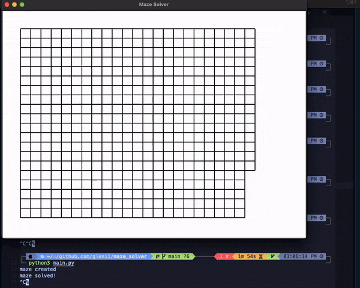
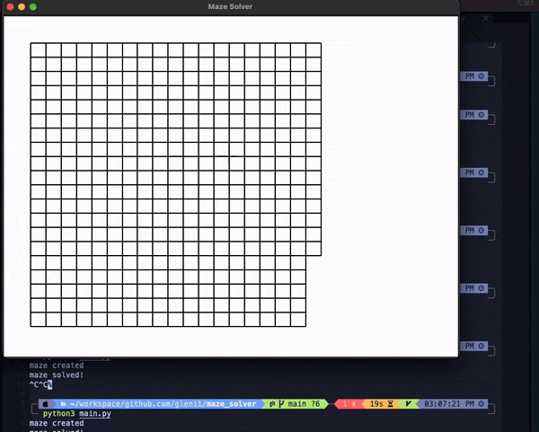

# Maze Solver

This is a Python-based maze solver project that generates and displays a maze with a configurable number of cells. The maze can be solved using two different algorithms: **Depth First Search (DFS)** or **Breadth First Search (BFS)**.

## Features

- **Configurable Maze Size**: You can specify the number of rows and columns to generate the maze.
- **Solve with DFS or BFS**: The program allows you to choose between DFS and BFS to find the path from the start to the finish.
- **Interactive Visualization**: The maze is visually displayed using a simple graphical interface, with cells representing walls and paths, and the algorithm's solving path highlighted.

## Visualization

